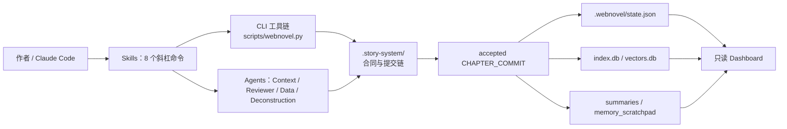
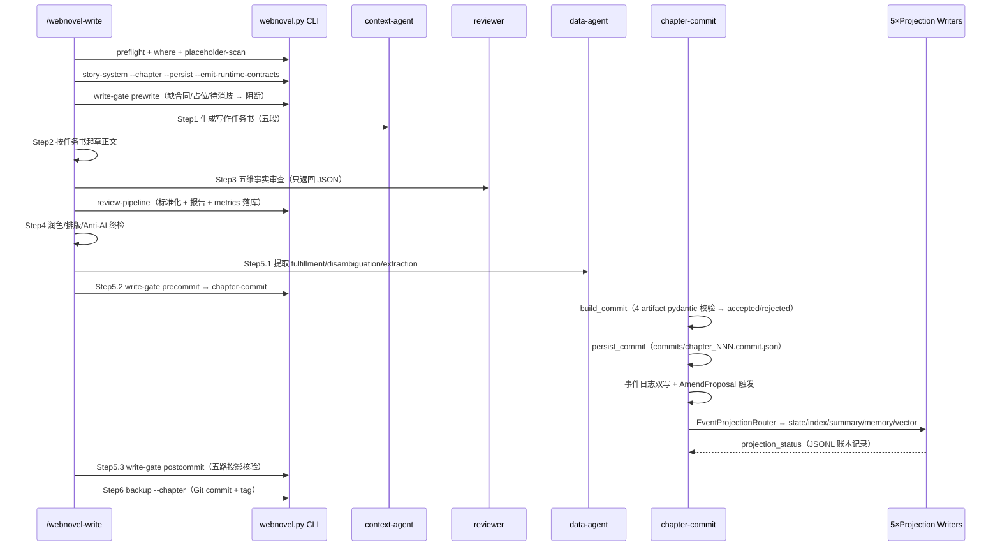

# 02 · 整体架构

## 1. 分层架构总览

| 层   | 组成                                                   | 职责                                                                                  |
| --- | ---------------------------------------------------- | ----------------------------------------------------------------------------------- |
| 命令层 | 8 个 Skills（`skills/*/SKILL.md`）                      | 定义用户可见的创作流程与关卡                                                                      |
| 代理层 | 4 个 Agents（`agents/*.md`）                            | 写前 research（context-agent）、事实审查（reviewer）、事实提取（data-agent）、拆书（deconstruction-agent） |
| 工具层 | CLI（`scripts/webnovel.py` → `data_modules/` + 根目录脚本） | 全部确定性数据操作                                                                           |
| 主链层 | `.story-system/`（合同 + 提交 + 事件）                       | **唯一事实源头**                                                                          |
| 投影层 | 5 个 Projection Writer                                | 从 accepted commit 派生 state / index / summary / memory / vector 五路只读视图               |
| 展示层 | Dashboard（FastAPI + React）                           | 只读可视化 + SSE 实时刷新                                                                    |
| 防护层 | hooks（SessionStart / PreToolUse）                     | 会话短状态 + 阻断绕过 runtime 链路的直接写入                                                        |

## 2. 真源划分（Single Source of Truth）

| 数据                                                                                   | 角色                  | 说明                                                                      |
| ------------------------------------------------------------------------------------ | ------------------- | ----------------------------------------------------------------------- |
| `.story-system/MASTER_SETTING.json`、`volumes/`、`chapters/`、`reviews/`                | **写前真源**            | 动笔前的合同（Master Setting / Volume Brief / Chapter Brief / Review Contract） |
| accepted `CHAPTER_COMMIT`（`.story-system/commits/`）                                  | **写后真源**            | 一章事实入账的唯一合法来源                                                           |
| `.webnovel/state.json`、`index.db`、`summaries/`、`memory_scratchpad.json`、`vectors.db` | **投影 / read-model** | 只从主链派生，永远可以重建                                                           |
| `references/genre-profiles.md`                                                       | fallback-only       | 高频题材判定已迁入 Story Contracts，仅作兜底                                          |

## 3. Story System 合同体系

### 3.1 四类合同（schema: `story-system/v1`）

| 合同             | 文件                                              | 内容                                                                                     | 生成者                                     |
| -------------- | ----------------------------------------------- | -------------------------------------------------------------------------------------- | --------------------------------------- |
| MasterSetting  | `.story-system/MASTER_SETTING.json`             | route / master\_constraints / base\_context / override\_policy                         | `story-system --persist`（init 阶段）       |
| ChapterBrief   | `.story-system/chapters/chapter_NNN.json`       | chapter\_directive / dynamic\_context / override\_allowed                              | `story-system --emit-runtime-contracts` |
| VolumeBrief    | `.story-system/volumes/volume_NNN.json`         | volume\_goal / selected\_tropes / selected\_pacing / selected\_scenes / anti\_patterns | `story-system --emit-runtime-contracts` |
| ReviewContract | `.story-system/reviews/chapter_NNN.review.json` | must\_check / blocking\_rules / review\_thresholds                                     | 同上                                      |

配套：`anti_patterns.json`（跨层反模式合并）、`commits/`（章节提交）、`events/`（事件审计）。

### 3.2 覆盖三层（OverrideBundle）

- `locked`：沿用 master，章节不可改

- `append_only`：章节只能追加去重

- `override_allowed`：章节可覆盖 master

### 3.3 事件审计链

- 事件类型（`StoryEvent`，共 10 种枚举）：`character_state_changed` / `relationship_changed` / `world_rule_revealed` / `world_rule_broken` / `power_breakthrough` / `artifact_obtained` / `promise_created` / `promise_paid_off` / `open_loop_created` / `open_loop_closed`

- 双写：`events/chapter_NNN.events.json`（JSON）+ `index.db story_events` 表（SQLite，`INSERT OR IGNORE` 保证重放幂等）

- `world_rule_broken` 事件自动触发 `AmendProposalTrigger` 生成修订提案（写入 `override_contracts` 表，status=pending）

## 4. 写章工作流（核心主链）

### 4.1 三道 write-gate（`data_modules/write_gates/`）

| 关卡         | 模块              | 校验内容                                                   |
| ---------- | --------------- | ------------------------------------------------------ |
| prewrite   | `prewrite.py`   | 项目根合法、无 blocking 占位符、Story System 健康合同齐备               |
| precommit  | `precommit.py`  | 4 份 artifact 齐 + review blocking=0 + commit 可 accepted |
| postcommit | `postcommit.py` | 五路投影 done/skipped + chapter\_status 推进到 committed      |

### 4.2 提交判定规则

`ChapterCommitService.build_commit()`：`blocking_count > 0`、`missed_nodes` 非空、`pending`（待消歧）非空 → **rejected**（只有 rejected 才允许不带投影重提）。

### 4.3 投影路由（`EventProjectionRouter`）

- rejected commit → 仅 `state` writer（推进章节状态机）

- accepted commit → 必含 `state + index`，再按 `entity_deltas → index`、`summary_text → summary`、事件类型路由表扩展 `memory / vector`

- 投影运行记录写入 `.webnovel/projection_log.jsonl`，失败可用 `projections retry/replay` 补跑

## 5. 防幻觉三定律

| 定律        | 说明         | 执行方式                                                |
| --------- | ---------- | --------------------------------------------------- |
| **大纲即法律** | 遵循大纲，不擅自发挥 | Context Agent 强制加载章节大纲（CBN/CPNs/CEN 节点）             |
| **设定即物理** | 遵守设定，不自相矛盾 | Reviewer Agent 内置一致性审查（5 维）                         |
| **发明需识别** | 新实体必须入库管理  | Data Agent 自动提取并消歧（entity\_deltas + disambiguation） |

## 6. Strand Weave 节奏系统

| Strand        | 含义    | 理想占比   | 红线         |
| ------------- | ----- | ------ | ---------- |
| Quest         | 主线剧情  | 55-65% | 连续不超过 5 章  |
| Fire          | 感情线   | 20-30% | 断档不超过 10 章 |
| Constellation | 世界观扩展 | 10-20% | 断档不超过 15 章 |

追踪载体：`state.json strand_tracker`（近章分布）→ 写前由 `ContextManager` / `writing_guidance_builder` 生成节奏指导，写后由 Data Agent 上报 `dominant_strand`，审查由 Pacing Checker 比对。

## 7. 数据一致性保障

| 机制              | 位置                                                           | 作用                                                                                                                           |
| --------------- | ------------------------------------------------------------ | ---------------------------------------------------------------------------------------------------------------------------- |
| Hooks 防护        | `hooks/guard_runtime_write.py`                               | 拦截对 `commits/`、`index.db`、`vectors.db`、`memory_scratchpad.json`、`projection_log.jsonl` 的直接写入（Write/Edit/Bash），强制走 runtime 链路 |
| 原子写 + 文件锁       | `scripts/security_utils.py`（`atomic_write_json`）+ `filelock` | 防 JSON 写坏、防并发                                                                                                                |
| run\_ledger     | `.webnovel/run_ledger.json`                                  | 写章六步（draft/review/data/commit/projection/backup）检查点 + 文件签名校验 → 断点续跑                                                          |
| projection\_log | `.webnovel/projection_log.jsonl`                             | 每次投影 run 的各 writer 状态 + commit hash，doctor/.retry 依赖                                                                         |
| run\_logger     | `.webnovel/logs/run_last.log`                                | 脱敏运行日志（redact api\_key/secret/token）                                                                                         |
| observability   | `data_modules/observability.py`                              | 永不抛异常的工具调用统计/性能计时包装                                                                                                          |

## 8. 架构设计要点小结

1. **合同优先 + 提交优先（contract-first / commit-first）**："怎么写"（合同）与"写了什么"（提交）分离，文笔可放开发挥，事实必须登记过审。
2. **CQRS 风格投影**：主链可重建，五路读模型允许失败重放（retry/replay）。
3. **多级降级**：RAG（graph\_hybrid → hybrid → BM25）、题材画像（contract-first → legacy profile）、项目根定位（显式 → 指针 → registry）均有兜底路径。
4. **作者友好**：技术故障经 `author_error_catalog.json` 翻译成作者可执行动作；agent 术语经 `author_glossary.json` 转译。
5. **纵深防御**：write-gate（流程级）+ hooks（工具级）+ 原子写（文件级）+ run\_ledger（断点级）。

