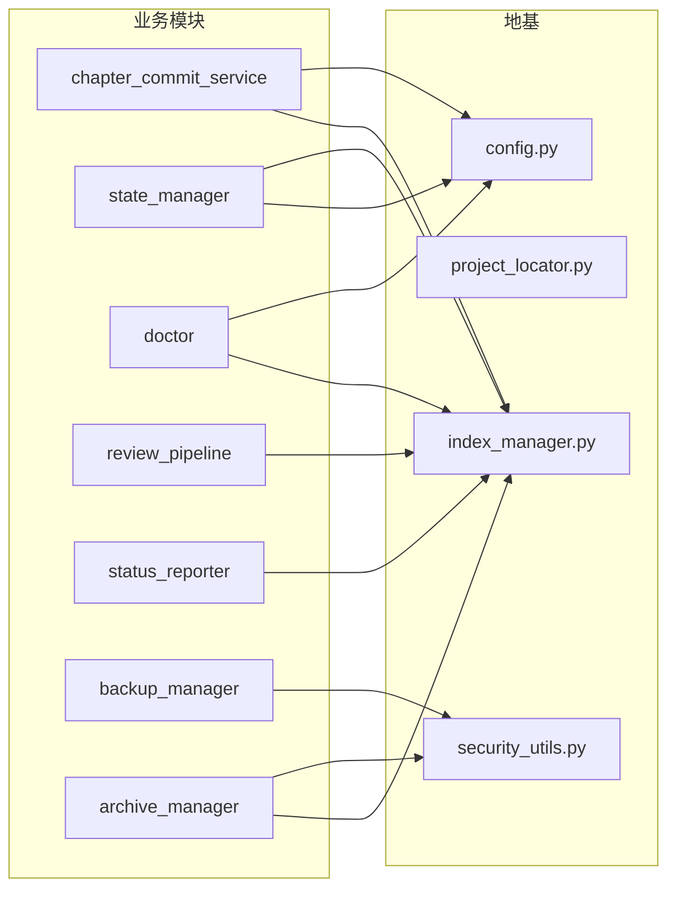
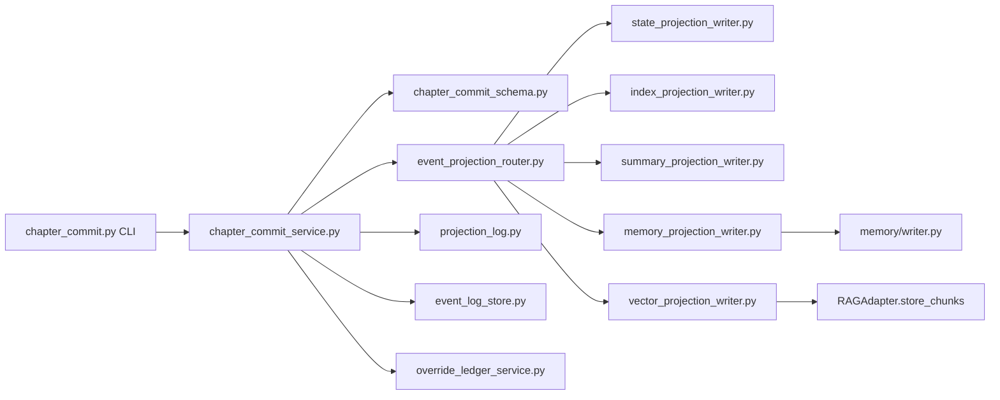

# 10 · 依赖关系详解

## 1. Python 运行时依赖

### 1.1 webnovel-writer/scripts/requirements.txt（工具链）

| 包 | 版本 | 用途 |
|----|------|------|
| aiohttp | >=3.8.0 | 异步 HTTP 客户端（Embedding/Rerank API 调用） |
| filelock | >=3.0.0 | 文件锁（state.json 等并发控制） |
| pydantic | >=2.0.0 | Schema 校验（合同/artifact/事件模型） |
| pytest* | >=7.0.0 | 测试（含 pytest-cov / pytest-asyncio / pytest-timeout） |

### 1.2 webnovel-writer/dashboard/requirements.txt（Dashboard）

| 包 | 版本 | 用途 |
|----|------|------|
| fastapi | >=0.115.0 | 只读 API 框架 |
| uvicorn[standard] | >=0.32.0 | ASGI 服务器 |
| watchdog | >=5.0.0 | 文件变更监听（SSE 实时刷新） |
| httpx | >=0.27.0 | HTTP 客户端 |

### 1.3 前端（dashboard/frontend/package.json）

| 包 | 版本 | 用途 |
|----|------|------|
| react / react-dom | 19 | UI 框架 |
| react-router-dom | 7 | 路由 |
| echarts / echarts-for-react | 5 | 图表 |
| vite | 6 | 构建（dev 代理 /api → 8765） |

> 运行环境要求 **Python ≥ 3.10**；Claude Code 宿主（Marketplace 安装）。

## 2. 模块依赖图（data_modules 层）

### 2.1 核心共享依赖（被调用最多的"地基"）



| 地基模块 | 依赖方 |
|----------|--------|
| `config.py` | 几乎全部 data_modules 与根脚本 |
| `project_locator.py` | webnovel CLI、story_system、update_state、status_reporter、archive/backup_manager、init_project 等 |
| `security_utils.py` | update_state、init_project、archive_manager、backup_manager、state_manager、project_memory、memory/store |
| `index_manager.py` | SQLStateManager、IndexProjectionWriter、chapter_commit_service（amend 提案）、status_reporter、review_pipeline、archive_manager、Dashboard 路由 |

### 2.2 提交主链调用树



### 2.3 状态双写链

```text
Data Agent 输出 → schemas.validate_data_agent_output
                  → StateManager.process_chapter_result（state.json + 原子写）
                  → _sync_to_sqlite → SQLStateManager → IndexManager（index.db）
StateProjectionWriter（accepted commit 路径）→ StateManager 同等写入
```

### 2.4 记忆/RAG 调用关系

```text
MemoryOrchestrator.build_memory_pack ◄── context_manager._build_pack
                                        └── memory_contract_adapter
MemoryWriter ──► ScratchpadManager（memory/store.py ──► security_utils.atomic_write_json）
RAGAdapter ──► api_client（EmbeddingAPIClient / RerankAPIClient）──► 外部 API
            ──► IndexManager.log_rag_query（观测）
QueryRouter ──► RAGAdapter.search（strategy=auto）
knowledge_query ──► index.db（直连只读）
```

## 3. 各层之间的依赖关系（跨目录）

```text
skills/*（Claude Code 明流程）
   │  调用（Bash/Read/Grep/Agent）
   ▼
webnovel.py CLI ──► data_modules/ + scripts/根目录脚本
   │
   ├──► references/csv/（reference_search.py BM25）◄── story_system_engine._collect_tables
   ├──► templates/（init/plan 读取产物模板）
   ├──► hooks/（session_start 调用 project-status；guard 拦截直接写入）
   └──► dashboard/（webnovel-dashboard skill 启动；doctor 校验 dist）
```

**反向依赖（不得违反）**：

- `data_modules` 不得依赖 `skills/*`（SKILL.md 只通过 CLI 调用）
- 子代理（agents/*.md）不得直接写 `.webnovel/.story-system`（通过 CLI/主流程）
- `dashboard/` 对 `scripts/` 是**导入依赖**（`_ensure_scripts_dir_on_path` 延迟导入 data_modules），但对书项目文件是只读

## 4. 数据文件血缘（谁写谁读）

| 数据文件 | 写入者 | 读取者 |
|----------|--------|--------|
| `.story-system/**` 合同 | story_system.py（story_system_engine） | context_manager、prewrite_validator、runtime_contract_builder、Dashboard |
| `.story-system/commits/*.commit.json` | chapter_commit_service.persist_commit | projections.py（重放）、story_runtime_sources、Dashboard |
| `.story-system/events/*.events.json` | EventLogStore.write_events | story_events.py、EventLogStore.read_events |
| `.webnovel/state.json` | StateManager / StateProjectionWriter / update_state / init_project | context_manager、status_reporter、project_locator、Dashboard、run_ledger |
| `.webnovel/index.db` | IndexManager（IndexProjectionWriter / SQLStateManager / review_pipeline） | knowledge_query、context_manager、status_reporter、Dashboard、doctor |
| `.webnovel/vectors.db` | VectorProjectionWriter → RAGAdapter.store_chunks | RAGAdapter.search / extract_chapter_context |
| `.webnovel/summaries/chNNNN.md` | SummaryProjectionWriter | context_manager、bootstrap、extract_chapter_context |
| `.webnovel/memory_scratchpad.json` | ScratchpadManager（MemoryWriter） | MemoryOrchestrator（写前注入） |
| `.webnovel/projection_log.jsonl` | append_projection_run | doctor、projections、run_ledger、Dashboard |
| `.webnovel/run_ledger.json` | run_ledger.record_write_step | run_ledger.build_write_resume_plan |

## 5. 外部依赖（运行时网络）

| 依赖 | 用途 | 缺省行为 |
|------|------|----------|
| Embedding API（OpenAI 兼容） | 向量化 chunks（`EMBED_BASE_URL/EMBED_MODEL/EMBED_API_KEY`） | 401/无 key → DEGRADED_MODE，退 BM25 |
| Rerank API（Jina/Cohere/DashScope/Modal） | 精排候选 | 失败回退 RRF 融合排序 |
| git（书项目本地） | 章节备份（backup_manager） | git 不可用优雅降级 |

## 6. 耦合度提示（改代码注意）

1. `chapter_commit_service.apply_projections()` 是**投影唯一事实执行入口**（事件路由只声明式激活 writer）——新增投影 writer 必须同时：
   - `event_projection_router.py` TABLE/required_writers 加路由规则
   - `projections.py` postcommit 校验、Dashboard commits 投影徽标、docs/templates/index-schema.md 同步
2. `commit_artifacts.py` 兼容新旧两层 extraction 写法——改 ExtractionResult 结构时必须保留访问器兼容
3. `index.db` 表/列变更：`_fetchall_safe`（Dashboard）与 `ensure_override_ledger_columns`（增量补列）是为了容忍旧库——**只增不删**
4. write-gate 三道关卡 + hooks 写守护 + run_ledger 三处校验同一不变量，改提交语义需三处同步